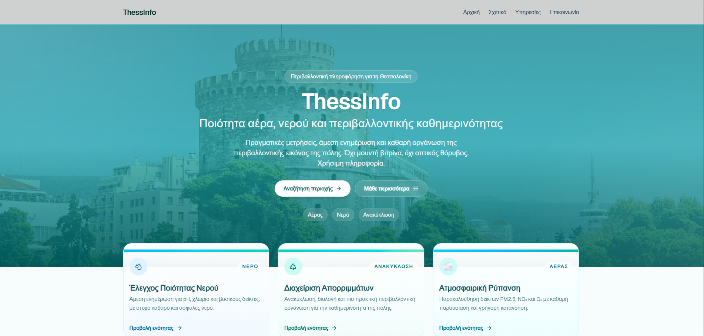
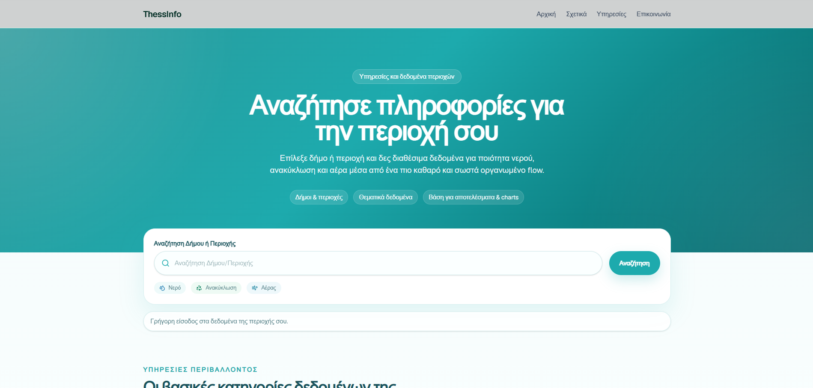
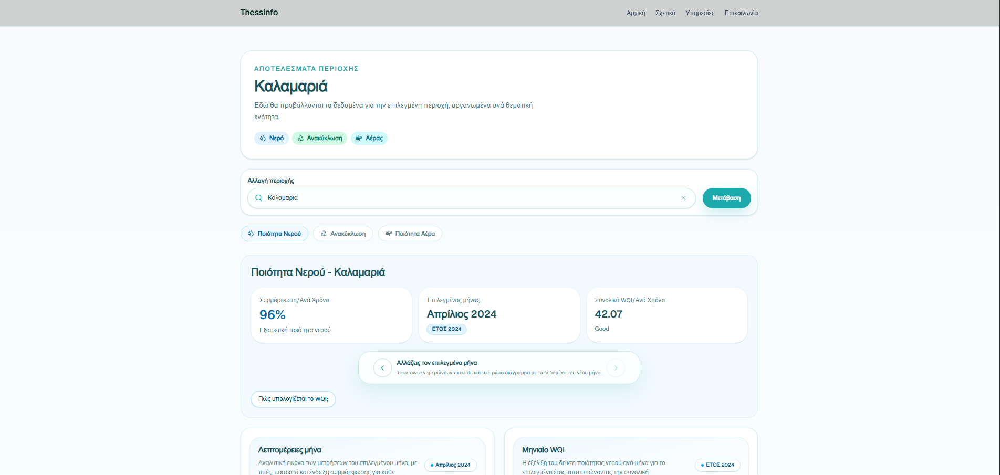
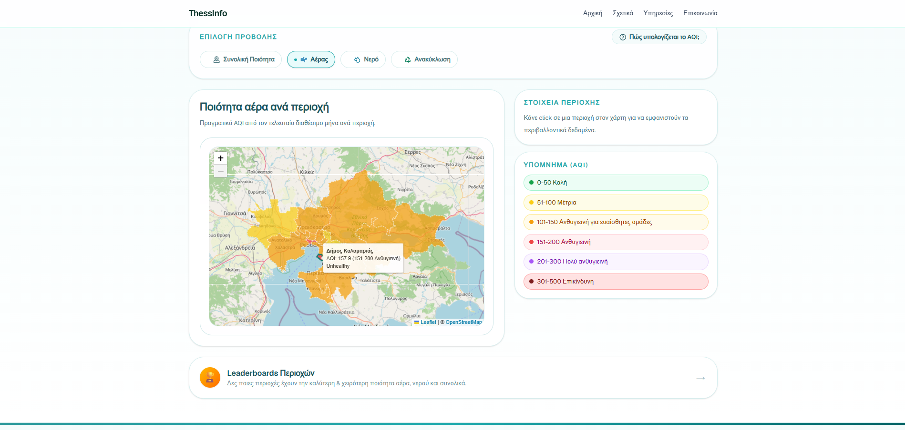
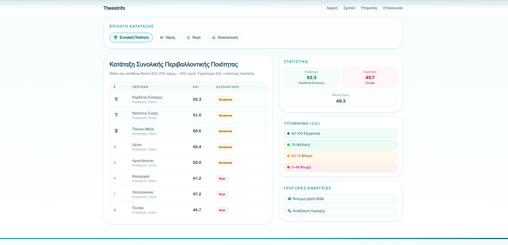

# ThessInfo — Environmental Data Platform

> Interactive platform that gathers, computes and visualizes air, water and recycling quality data across the municipalities of Thessaloniki, Greece — turning scattered public data into clear, comparable indices that anyone can understand.

🔗 **Live Demo:** [thessinfo.vercel.app](https://thessinfo.vercel.app)
📦 **Legacy v1:** [users.it.teithe.gr/~iliasalt/ThessInfo](https://users.it.teithe.gr/~iliasalt/ThessInfo/)

---

## 🎓 Academic Context

This is the **second iteration** of ThessInfo, originally developed as an entry to the **Open Data Greece** competition. The current version is a complete rewrite, built as a university project for the course **«Διαδικτυακές Υπηρεσίες Προστιθέμενης Αξίας»** (*Online Value-Added Services*) at:

> **ΔΙ.ΠΑ.Ε. — International Hellenic University**
> Department of Information & Electronic Engineering
> 8th Semester

**Team:**

| Name | Student ID |
|---|---|
| Ρετσιλάς Γεώργιος (Retsilas Georgios) | 2022143 |
| Σαλτσίδης Ηλίας (Saltsidis Ilias) | 2022149 |

---

## 📌 Purpose

- **Explore by Region** — Interactive map and sortable leaderboard to compare environmental metrics across each municipality.
- **Transparent Insights** — Instant access to water turbidity, pH, chlorine, air pollutants (NO₂, SO₂, O₃, CO, NO) and recycling efficiency per capita.
- **Highlight Excellence** — Surface top-performing municipalities in each category with deep dives into monthly and yearly trends.
- **Data-Driven Policy** — Support informed decision-making for local authorities and environmental agencies.

---

## ✨ What's New in v2

| | v1 (legacy) | **v2 (current)** |
|---|---|---|
| **Backend** | Django + DRF | **FastAPI** (serverless on Vercel) |
| **Frontend** | React + Vite | **Next.js 16** (App Router, React 19) |
| **State** | React Context + Axios | **Zustand** store with request dedup |
| **Styling** | CSS Modules | **Tailwind CSS 4** + shadcn/ui primitives |
| **Indices** | Per-domain compliance | **Composite EQI** (Environmental Quality Index) |
| **UX** | Search → table → map | **Map / Leaderboard / Region** as first-class pages |
| **Data depth** | Per-region pages | Multi-year history with tabs (Water / Air / Recycle) |

### Headline additions

- 🧮 **Composite EQI Engine** — combines normalized AQI + WQI on a band-aligned 0–100 scale with critical-override anti-masking logic.
- 🗺️ **Interactive map** with metric switching (Overall / Air / Water / Recycling), live tooltips and color-coded polygons.
- 🏆 **Live Leaderboard** ranking municipalities per metric with medal indicators.
- 📊 **Per-region detail pages** (`/services/[slug]`) with tabbed views for Water / Air / Recycling and inline charts.
- ℹ️ **Info modals** explaining each index methodology, parameters and bands.

> 📌 Note: **AQI**, **WQI** and **Recycling Efficiency** were not part of v1 — they are introduced in this iteration as part of the new Quality Index framework.

---

## 📸 Screenshots

| | |
|---|---|
|  |  |
| **Homepage** — Hero section with the three thematic pillars (Water · Air · Recycling) | **Services / Search** — Fuzzy autocomplete across all municipalities |
|  |  |
| **Region Detail** (Καλαμαριά) — Tabbed view with monthly WQI, compliance % and yearly trends | **Interactive Map** — Color-coded polygons with metric switching and live tooltips |


**Leaderboard** — Live ranking of municipalities by EQI (or any of AQI / WQI / Recycling) with medal indicators, statistics and legend

---

## 🧮 Quality Index System

The platform's centerpiece is its three‑tier index framework:

### 1️⃣ AQI — Air Quality Index ([code](Backend/app/airquality/services.py))

Per pollutant, compares the monthly average to the WHO annual guideline:

```
PIᵢ = (avgᵢ / limitᵢ) × 100
AQI = max(PI_NO₂, PI_SO₂, PI_O₃, PI_CO, PI_NO)
```

The **maximum** (not the sum or average) determines the AQI — a single critical pollutant is enough to compromise air quality. The pollutant with the highest PI is exposed as the *dominant pollutant*.

| Pollutant | Limit | Unit |
|---|---|---|
| NO₂ | 9.5 | μg/m³ |
| SO₂ | 10.0 | μg/m³ |
| O₃  | 50.0 | μg/m³ |
| CO  | 4.0  | mg/m³ |
| NO  | 1.5  | μg/m³ |

### 2️⃣ WQI — Water Quality Index ([code](Backend/app/waterdata/services.py))

Weighted average of six physico-chemical parameters, based on the foundational
**Brown et al. (1970)** WQI framework — *"A Water Quality Index — Do We Dare?"* —
adapted to the EU Drinking Water Directive (98/83/EC) parameters and limits.
The full reference paper is available in [official_papers/](official_papers/A-Water-Quality-Index-Do-we-dare-BROWN-R-M-1970.pdf).

```
qᵢ = 100 × (Vᵢ − Iᵢ) / (Sᵢ − Iᵢ)
WQI = Σ(Wᵢ × qᵢ) / Σ(Wᵢ)
```

| Parameter | Sᵢ (limit) | Iᵢ (ideal) | Wᵢ (weight) |
|---|---|---|---|
| pH | 8.5 | 7.0 | 0.22 |
| Residual chlorine | 0.5 | 0.0 | 0.20 |
| Turbidity | 1.0 | 0.0 | 0.15 |
| Aluminium | 200 | 0.0 | 0.12 |
| Chlorides | 250 | 0.0 | 0.10 |
| Conductivity | 2500 | 0.0 | 0.08 |

When a parameter is missing, both the numerator and denominator skip it — no penalty for sparse data.

### 3️⃣ EQI — Environmental Quality Index ([code](Backend/app/sharedqi.py))

The composite index that combines AQI and WQI into a single 0–100 score:

1. **Normalize** both indices to a common 0–100 scale with piecewise breakpoints (band-aligned, so "Good AQI" ≈ "Excellent WQI").
2. **Weighted average:** `0.7 × air_norm + 0.3 × water_norm` (air is weighted higher because exposure is continuous and unavoidable).
3. **Critical override (anti-masking):** if either factor ≥ 60, then `raw = max(weighted, worst × 0.85)` — a critical metric cannot hide behind a healthy one.
4. **Display flip:** `EQI_display = 100 − raw` so that **higher = better**.
5. **Severity-based dominant factor:** the dominant factor is the one whose severity band is worse — not the higher raw value.

### 4️⃣ Recycling Metrics ([code](Backend/app/recycle/services.py))

Two complementary indicators per municipality:

- **kg / capita** — citizen participation (quantity)
- **Efficiency ratio** — sorting quality at the recycling facility (KDAU):
  ```
  Efficiency = Recyclables / (Recyclables + Residual)
  ```
  The *residual* is the share of blue-bin contents that turn out to be non-recyclable and end up in landfill. Higher efficiency = better source separation by citizens. Target ≥ 70%.

---

## 🚀 Features

- 🗺️ **Interactive Leaflet Map** — color-coded polygons, sticky tooltips with live data, click-to-detail sidebar, metric switcher.
- 📈 **Responsive Charts** — monthly and yearly trends via Recharts (line, bar, stacked area).
- 🏅 **Leaderboard** — sortable per metric with medal indicators for top performers.
- 🔍 **Region Search** — fuzzy search across all municipalities with autocomplete.
- 📑 **Per-Region Pages** — dynamic routes (`/services/[slug]`) with Water / Air / Recycle tabs.
- ℹ️ **Info Modals** — methodology explainers for EQI, AQI, WQI and recycling indicators.
- ⚡ **Smart Caching** — Zustand store with request deduplication; `lru_cache` on the backend.
- 📱 **Responsive Design** — mobile-first layout with proper navigation drawer.
- 🌐 **Greek UI** — fully localized for the target audience.

---

## 🏗️ Architecture

```
┌──────────────────────────────┐       ┌──────────────────────────────┐
│   Backend (FastAPI)          │◀──────│   Frontend (Next.js 16)      │
│                              │       │                              │
│   ┌─────────────────────┐    │       │   ┌─────────────────────┐    │
│   │ routers:            │    │       │   │ pages:              │    │
│   │  /air               │    │       │   │  /                  │    │
│   │  /water             │    │       │   │  /map               │    │
│   │  /recycling         │    │       │   │  /leaderboard       │    │
│   │  /sharedqi          │    │       │   │  /services/[slug]   │    │
│   └─────────────────────┘    │       │   │  /themes/[slug]     │    │
│            │                 │       │   └─────────────────────┘    │
│            ▼                 │       │            │                 │
│   ┌─────────────────────┐    │       │            ▼                 │
│   │ services + sharedqi │    │       │   ┌─────────────────────┐    │
│   │ (EQI engine)        │    │       │   │ Zustand store       │    │
│   └─────────────────────┘    │       │   │ + Region cache      │    │
│            │                 │       │   └─────────────────────┘    │
│            ▼                 │       │            │                 │
│   ┌─────────────────────┐    │       │            ▼                 │
│   │ JSON datasheets     │    │       │   ┌─────────────────────┐    │
│   │ (cached lru_cache)  │    │       │   │ Leaflet + Recharts  │    │
│   └─────────────────────┘    │       │   └─────────────────────┘    │
└──────────────────────────────┘       └──────────────────────────────┘
```

---

## 🛠️ Technologies

### Backend
- **Python 3** · **FastAPI** 0.135 · **Uvicorn**
- `lru_cache` for in-memory aggregation
- Structured JSON datasheets as source of truth
- Deployed serverlessly on **Vercel**

### Frontend
- **Next.js 16** (App Router, React Server Components where possible)
- **React 19** · **TypeScript** 5.9
- **Tailwind CSS 4** + **shadcn/ui** primitives
- **Leaflet** + **react-leaflet** for the map
- **Recharts** for charts
- **Zustand** for client-side state
- **framer-motion** for entry animations

### Tooling
- ESLint · Prettier · `prettier-plugin-tailwindcss`
- Turbopack-powered dev server

---

## 📦 Installation & Setup

### Prerequisites
- **Node.js 20+**
- **Python 3.11+**
- **npm** (or pnpm/yarn)

### 1. Clone

```bash
git clone https://github.com/Retsos/ThessInfo.git
cd ThessInfo
```

### 2. Backend

```bash
cd Backend
python -m venv venv
# Windows:
venv\Scripts\activate
# macOS / Linux:
source venv/bin/activate

pip install -r requirements.txt
uvicorn app.server:app --reload --host 0.0.0.0 --port 8000
```

Backend will be available at **http://127.0.0.1:8000**.

### 3. Frontend

```bash
cd Frontend
npm install
```

Create a `.env.local` file in `Frontend/`:

```env
NEXT_PUBLIC_API_URL=http://127.0.0.1:8000
```

Then run:

```bash
npm run dev
```

Frontend available at **http://localhost:3000**.

### 4. Production build

```bash
cd Frontend
npm run build
npm start
```

---

## 📊 API Endpoints

### Air Quality (`/air`)
| Endpoint | Purpose |
|---|---|
| `GET /air/areas` | List of available municipalities |
| `GET /air/area/{area}/latest-month` | Latest monthly aggregation |
| `GET /air/area/{area}/month/{year}/{month}` | Specific month detail |
| `GET /air/area/{area}/air-index/monthly` | Monthly AQI time series |
| `GET /air/area/{area}/air-index/yearly` | Yearly aggregates |

### Water Quality (`/water`)
| Endpoint | Purpose |
|---|---|
| `GET /water/months/{area}` | Available month timestamps |
| `GET /water/analysis/{area}/{month_ts}` | Detailed monthly analysis |
| `GET /water/wqi/monthly/{area}/{year}` | Monthly WQI per year |
| `GET /water/wqi/overall/{area}/{year}` | Yearly overall WQI |
| `GET /water/stats/{area}/{year}` | Compliance stats |

### Recycling (`/recycling`)
| Endpoint | Purpose |
|---|---|
| `GET /recycling/areas` | List of areas + available years |
| `GET /recycling/monthly` | Monthly data per area & year |
| `GET /recycling/compare` | Cross-area comparison |
| `GET /recycling/efficiency` | Monthly efficiency ratio |
| `GET /recycling/summary` | Dashboard summary |

### Composite QI (`/sharedqi`)
| Endpoint | Purpose |
|---|---|
| `GET /sharedqi/areas` | All areas with combined EQI + dominant factor |

---

## 📁 Project Structure

```
ThessInfo/
├── Backend/
│   ├── app/
│   │   ├── airquality/        # AQI routes, services, datasheets
│   │   ├── waterdata/         # WQI routes, services, datasheets
│   │   ├── recycle/           # Recycling routes, parser, datasheets
│   │   ├── sharedqi.py        # EQI composite engine
│   │   ├── sharedqi_routes.py
│   │   └── server.py          # FastAPI app entry
│   ├── requirements.txt
│   └── vercel.json
└── Frontend/
    ├── app/
    │   ├── (home, about, contact, services, themes,
    │   │  leaderboard, map, learn-more)/
    │   ├── components/        # shared sections, results tabs, map, services
    │   ├── data/              # region catalog, geojson
    │   └── api/geojson/       # static geojson serving
    ├── lib/
    │   ├── store/             # Zustand store
    │   ├── services/          # fetchers per domain
    │   └── quality-indexes.ts # band definitions
    └── components/ui/         # shadcn primitives
```

---

## 🤝 Contributing

1. Fork the repository
2. Create a feature branch (`git checkout -b feature/your-feature`)
3. Commit changes (`git commit -m "describe your change"`)
4. Push and open a PR against `main`

Please ensure consistency with the existing code style (ESLint + Prettier on the frontend).

---

## 🙏 Acknowledgements

- **Open Data Greece** for hosting the original competition that started this project.
- **OpenStreetMap** community for the free map tiles.
- **Municipalities & Universities** of Thessaloniki for providing open environmental data.
- **WHO** Air Quality Guidelines as the reference framework for AQI limits.

---

## 📚 References

The methodological foundations of the indices used in this platform:

1. **Brown, R. M., McClelland, N. I., Deininger, R. A., & Tozer, R. G.** (1970).
   *A Water Quality Index — Do We Dare?*
   Water and Sewage Works, 117(10), 339–343.
   👉 [Local copy](official_papers/A-Water-Quality-Index-Do-we-dare-BROWN-R-M-1970.pdf) — original WQI weighted-arithmetic formulation that this implementation builds upon.

2. **World Health Organization (WHO)** (2021).
   *WHO Global Air Quality Guidelines: Particulate Matter (PM2.5 and PM10), Ozone, Nitrogen Dioxide, Sulfur Dioxide and Carbon Monoxide.*
   Annual mean reference values used as `limitᵢ` in the AQI computation.

3. **Council Directive 98/83/EC** — On the quality of water intended for human consumption.
   Source of the regulatory parametric values (`Sᵢ`) used in the WQI configuration.

4. **HRADF / National recycling reports** — Source data structure for the recycling
   efficiency framework (Recyclables vs. KDAU Residual at sorting facilities).

---

## 📄 License

This project is licensed under the **MIT License**.

---

Built from ThessInfo Team, 2026
